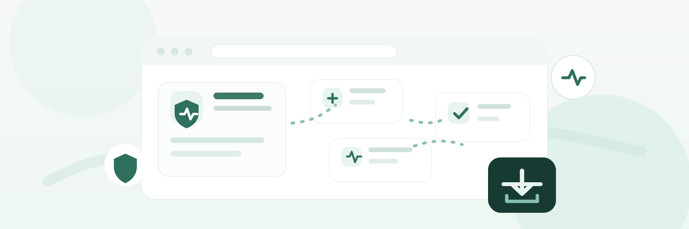

<p align="center">
  
</p>

# Sundhedsarkiv

Sundhedsarkiv er en Chrome-extension, der hjælper dig med at hente dine egne sundhed.dk-data ud i et lokalt ZIP-arkiv.

Du logger selv ind på sundhed.dk, klikker dig gennem en guidet data-runde i extensionen, og downloader derefter data som rå JSON, Markdown og CSV. Extensionen sender ikke dine sundhedsdata til en server.

## Hvad kan den?

- Guider dig til login på sundhed.dk.
- Leder dig trin for trin gennem relevante sider på Min sundhedsjournal.
- Opsamler sundhed.dk API-svar fra din egen browser-session.
- Viser løbende om der er fundet data, og hvor mange records der er fundet.
- Eksporterer et samlet ZIP-arkiv med rå data og mere læsbare filer.
- Kører lokalt i Chrome. Ingen backend, ingen cloud, ingen automatisk MitID-login.

## Før du starter

Du skal bruge:

- Google Chrome.
- Node.js og npm, hvis du vil bygge extensionen lokalt.
- Adgang til sundhed.dk med MitID.
- Et par minutter til at klikke gennem sektionerne i extensionen.

Vigtigt: ZIP-filen kan indeholde følsomme sundhedsoplysninger. Gem den et sted, du har kontrol over, og del den ikke uden en konkret grund.

## Hurtig start for testere

### 1. Byg extensionen

Kør dette i projektmappen:

```bash
npm install
npm run build
```

Efter build ligger den færdige Chrome-extension i mappen `dist/`.

### 2. Indlæs den i Chrome

1. Åbn `chrome://extensions` i Chrome.
2. Slå `Developer mode` til øverst til højre.
3. Klik `Load unpacked`.
4. Vælg mappen `dist/`.
5. Pin gerne Sundhedsarkiv-ikonet i Chrome, så det er nemt at åbne.

Når du bygger en ny version senere, skal du tilbage til `chrome://extensions` og trykke `Reload` på extensionen.

### 3. Kør en data-runde

1. Klik på Sundhedsarkiv-ikonet og åbn sidepanelet.
2. Acceptér den lokale data-advarsel, hvis du bliver spurgt.
3. Klik `Log ind`.
4. Log selv ind på sundhed.dk med MitID.
5. Gå tilbage til sidepanelet.
6. Klik `Start opsamling`.
7. Klik dig gennem sektionerne under `Trin 2`.
8. Vent et øjeblik på hver side, indtil tallet i sidepanelet opdateres.
9. Klik `Download arkiv`, når du er færdig.

Du behøver ikke have data i alle sektioner. `0 records` kan være helt korrekt, hvis sundhed.dk ikke har noget at vise for dig i den sektion.

## Tips til prøvesvar

Prøvesvar er en af de vigtigste sektioner at teste grundigt.

Når du åbner prøvesvar:

- Tjek om sundhed.dk viser en periodevælger eller filter.
- Sundhedsarkiv forsøger automatisk at hente prøvesvar 5 år tilbage, når svaroversigten er indlæst.
- Vent på at listen er færdig med at indlæse.
- Kig i sidepanelet efter records, ikke kun API-kald.
- Hvis der mangler gamle prøvesvar, så prøv at ændre perioden igen og vent på ny indlæsning.

Hvis sidepanelet viser få records, men siden visuelt viser mange prøvesvar, er det en fejl vi bør undersøge med et nyt `test-run`.

## Hvad ligger i ZIP-filen?

Eksporten får et navn som:

```text
sundhed-dk-eksport-YYYY-MM-DD.zip
```

Indholdet er typisk:

```text
manifest.json
sundhed-dk-eksport.md
raw/medicin.json
raw/proevesvar.json
raw/...
markdown/medicin.md
markdown/proevesvar.md
markdown/...
csv/medicin.csv
csv/proevesvar.csv
csv/aftaler.csv
csv/vaccinationer.csv
csv/diagnoser.csv
```

`manifest.json` er overblikket. Den viser hvornår eksporten blev lavet, hvilke sektioner der blev gennemgået, antal API-svar og antal records.

`raw/` er de oprindelige JSON-svar fra sundhed.dk. Det er mest nyttigt til debugging.

`markdown/` og `sundhed-dk-eksport.md` er læsbare tekstversioner.

`csv/` indeholder tabeller for de sektioner, hvor extensionen allerede har en struktureret parser.

## Understøttede sektioner

| Sektion | Status i eksport |
| --- | --- |
| Medicin | Rå JSON, Markdown og CSV |
| Prøvesvar | Rå JSON, Markdown og CSV |
| Vaccinationer | Rå JSON, Markdown og CSV |
| Aftaler | Rå JSON, Markdown og CSV |
| Diagnoser | Rå JSON, Markdown og CSV |
| Journaler | Rå JSON, Markdown og CSV; detailkald hentes fra forløbsoversigten under aktiv opsamling |
| Henvisninger | Rå JSON og Markdown-opsummering |
| Egen læge | Rå JSON og Markdown-opsummering |
| Røntgen | Rå JSON og Markdown-opsummering |
| Hjemmemålinger | Rå JSON og Markdown-opsummering |
| Forløbsplaner | Rå JSON og Markdown-opsummering |

Nogle sektioner er mere modne end andre. Når en sektion kun har rå JSON og opsummering, betyder det at data stadig bliver gemt, men at vi endnu ikke har lavet en pæn CSV-parser til den.

## Fejlfinding

### Extensionen opsamler ikke noget

- Tjek at du har klikket `Start opsamling`.
- Tjek at du er på `www.sundhed.dk`.
- Genindlæs sundhed.dk-siden efter du har startet opsamlingen.
- Klik `Opdater status` i sidepanelet.
- Prøv `Ryd opsamlede data` og start igen.

### Jeg har lige bygget ny kode, men Chrome bruger den gamle version

1. Kør `npm run build`.
2. Gå til `chrome://extensions`.
3. Klik `Reload` på Sundhedsarkiv.
4. Genindlæs sundhed.dk-fanen.
5. Åbn sidepanelet igen.

### En sektion viser 0 records

Det kan være korrekt, hvis du ikke har data i sektionen. Hvis sundhed.dk tydeligt viser data på siden, men extensionen viser `0 records`, så gem et nyt `test-run` og noter hvilken sektion det gælder.

### Der mangler noget i CSV

Kig først i `raw/<sektion>.json`. Hvis data findes i `raw/`, men ikke i CSV, mangler parseren at blive forbedret. Hvis data ikke findes i `raw/`, fangede extensionen ikke API-kaldet.

## Udvikling

De vigtigste kommandoer:

```bash
npm install
npm run build
npm test
```

`npm run build` laver TypeScript-check og bygger extensionen.

`npm test` kører Vitest-testene. Testene bruger lokale fixtures og simulerede sundhed.dk-svar. De logger ikke ind med MitID og kalder ikke live sundhed.dk.

Der findes også et audit-script:

```bash
node scripts/audit-sundhed-api.mjs test-run
```

Brug det til at gennemgå et lokalt test-run og se, hvilke API-kald og sektioner der blev fanget.

## Privatliv og sikkerhed

- Extensionen automatiserer ikke MitID.
- Data opsamles fra din egen browser-session.
- Data gemmes midlertidigt i Chrome under testen.
- `Ryd opsamlede data` sletter den midlertidige capture-state.
- ZIP-filen ligger lokalt på din maskine efter download.
- Upload ikke rigtige sundhedsdata til GitHub.
- Commit ikke private `test-run`-eksporter.

## Projektstatus

Dette er en lokal MVP til test og videreudvikling. Den er ikke et medicinsk produkt, ikke en officiel sundhed.dk-integration og ikke en erstatning for sundhedsfaglig rådgivning.
